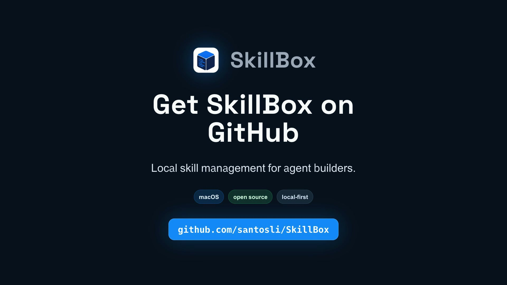

# SkillBox

> Manage agent skills across local runtimes.

English | [简体中文](README.zh-CN.md)


SkillBox is a local-first macOS app and CLI for managing `SKILL.md`-based skills, rules, prompts, and capability packs without treating any one agent runtime as the source of truth.

Current release: `v0.3.3`. SkillBox is useful today for local skill management, but it is still early software. Keep backups of important skills, and review each filesystem change before applying it.

## Promo Video

[](docs/promo/skillbox-intro/skillbox-promo.mp4)

A 30-second overview of SkillBox: local-first skill management, review-before-import, remote updates, usage history, and GitHub-backed releases.

## Why

- **One managed store for every runtime.** Keep durable skill state in `~/.skillbox`, then deploy into each agent runtime as needed.
- **One-click local sync.** Commit and push user skill changes from the managed store without leaving the desktop app.
- **Scheduled remote checks.** Refresh remote skill status automatically and review available updates before applying them.
- **Usage stats for real skill calls.** Record skill calls from supported agent hooks, then surface call counts in cards and history.
- **Versioned remote skills.** Preview diffs, apply updates, and roll back to immutable remote skill versions.
- **Review before import.** Classify local scan candidates as user, remote, or system before SkillBox copies anything.
- **Safe deployment defaults.** Use symlinks by default and refuse to silently overwrite existing runtime content.

## Screenshots


Skill cards make usage and maintenance state visible at a glance, including call counts, update status, user-edited tags, favorites, and deployed runtime targets.


The skill detail view collects workspace deployment, usage, version history, source binding, update review, rollback, tags, and operation history in one place.


The Workspaces view tracks global and project-local skill roots across Codex CLI, Claude Code, Codex App, and project-specific runtimes.


History combines real skill calls and management operations, with prompt excerpts redacted down to small, reviewable snippets.


Import review keeps local scans explicit: candidates are classified before SkillBox copies them into the managed store.

## What SkillBox Manages

SkillBox keeps its managed store under `~/.skillbox` by default:

```text
~/.skillbox/
  user-skills/
    <skill-name>/
      SKILL.md
  remote-skills/
    <skill-name>/
      source.json
      current -> versions/<version>
      versions/
        <version>/
          SKILL.md
  backups/
  skillbox.sqlite
```

Runtime directories are deployment targets:

- `~/.codex/skills`
- `~/.agents/skills`
- `~/.claude/skills`
- project-local `.codex/skills`
- project-local `.agents/skills`
- project-local `.claude/skills`

Longer-term support for Claude, OpenClaw, Cursor, Claude Code, Copilot, and other native formats should go through explicit agent adapters rather than hard-coded UI behavior.

## Features

- Scan local `SKILL.md` roots and return sorted skills with frontmatter metadata, content hashes, symlink status, and scan errors.
- Import existing local skills into `~/.skillbox/user-skills` or `~/.skillbox/remote-skills`.
- Deploy and undeploy managed skills into runtime folders through symlinks.
- Install remote skills from GitHub tree, blob, raw, and contents API URLs that point to skill directories or `SKILL.md`.
- Track remote GitHub sources, check for updates, preview all-file diffs, apply updates, and roll back to immutable versions.
- Manage workspace roots for global and project-local runtimes.
- Sync user skills through a shared Git repository with desktop diff review and Conventional Commit message generation.
- Record usage events from Codex App, Codex CLI, and Claude Code CLI hooks without storing full chat transcripts.
- Browse desktop operation and usage history from SQLite-backed records.
- Check signed macOS app updates from GitHub Releases and install them only
  after user confirmation.

## Requirements

- macOS 14 Sonoma or newer
- Git, for user-skill sync and remote skill workflows
- An agent runtime that uses `SKILL.md` directories

Windows, Linux, and a Homebrew CLI formula are not part of the current release.

## Install

### GitHub Releases

Download the signed and notarized DMG from:

https://github.com/santosli/SkillBox/releases

For this release, use the asset named:

```text
SkillBox_0.3.3_universal.dmg
```

The matching checksum is published as:

```text
SkillBox_0.3.3_universal.dmg.sha256
```

Open the DMG and drag `SkillBox.app` into `/Applications`.

DMG installs can use Settings -> App updates to check signed GitHub Releases
and install updates after confirmation.

### Homebrew

The cask uses the project tap instead of the official Homebrew Cask repository:

```sh
brew tap santosli/tap
brew install --cask skillbox
```

Upgrade with:

```sh
brew upgrade --cask skillbox
```

Uninstall with:

```sh
brew uninstall --cask skillbox
```

Homebrew uninstall does not delete `~/.skillbox`.

## First Run

1. Open SkillBox.
2. Run `Scan` to discover known global and project-local skill workspaces.
3. Use `Import` to review candidates before SkillBox copies them into `~/.skillbox`.
4. Use `Install` to add GitHub-backed remote skills to the managed store without deploying them automatically.
5. Deploy managed skills to selected runtime workspaces when you want an agent to use them.
6. Optional: enable usage hook injection in Settings to record real skill calls.

## Permissions And Local Changes

SkillBox is local-first and does not require a hosted account. The app may:

- scan known runtime directories for `SKILL.md` folders;
- write managed copies and metadata under `~/.skillbox`;
- create symlinks from runtime directories back to managed skills;
- initialize and update Git metadata for `~/.skillbox/user-skills`;
- modify supported runtime hook config files when you explicitly inject hooks.

SkillBox treats runtime folders, GitHub URLs, downloaded archives, and existing skills as untrusted input. It should not silently overwrite a non-symlink runtime target.

## Uninstall And Reset

See [docs/uninstall-reset.md](docs/uninstall-reset.md) for removing the app, reverting hook injection, deleting runtime symlinks, and optionally removing the managed store.

## Architecture

```text
React desktop UI
  -> Tauri commands
  -> skillbox-core / skillbox-github / skillbox-git
  -> local filesystem, SQLite, Git, and structured GitHub source metadata
```

Workspace layout:

```text
apps/desktop/              Tauri + React desktop app
apps/desktop/src-tauri/    Tauri command bridge
crates/skillbox-core/      scan, import, GitHub install, deploy, SQLite, workspaces, updates, hooks
crates/skillbox-github/    GitHub skill URL parsing and normalization
crates/skillbox-git/       structured Git service boundary
crates/skillbox-cli/       Rust CLI
docs/                      architecture, data model, workflows, ADRs
```

New core business logic should go into Rust crates. React should call structured Tauri commands instead of owning filesystem, Git, GitHub download, migration, or rollback behavior.

## Docs

- [Roadmap](docs/roadmap.md)
- [Good first issues](docs/good-first-issues.md)
- [Architecture](docs/architecture.md)
- [Data model](docs/data-model.md)
- [Workflows](docs/workflows.md)
- [Implementation status](docs/implementation-status.md)
- [Contributing](CONTRIBUTING.md)
- [Managed store ADR](docs/decisions/0001-managed-store-is-source-of-truth.md)
- [Symlink deployment ADR](docs/decisions/0002-symlink-deployment-by-default.md)
- [Rust core migration ADR](docs/decisions/0003-migrate-node-cli-behavior-to-rust-core.md)
- [Agent adapter ADR](docs/decisions/0004-support-multiple-agent-runtimes-through-adapters.md)

## Development

See [CONTRIBUTING.md](CONTRIBUTING.md) for local setup, test commands, release invariants, and contribution guidelines.
New contributors can start with [Good first issues](docs/good-first-issues.md)
or the public [Roadmap](docs/roadmap.md).

Useful commands:

```sh
npm test
cargo test --offline
npm --workspace apps/desktop run build
npm run docs:check-staged
```

For UI changes, also run the Vite or Tauri app and verify the affected screen manually.

## License

SkillBox is available under the [MIT License](LICENSE).
