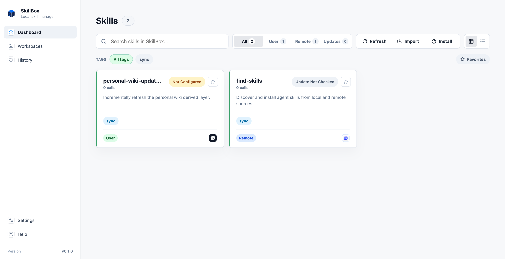

# SkillBox

SkillBox is a local-first macOS app for discovering, importing, and deploying
agent skills across Codex-style runtimes.

Public alpha status: SkillBox is useful today for local skill management, but it
is still early software. Expect sharp edges, keep backups of important skills,
and review each filesystem change before applying it.



## What SkillBox Manages

SkillBox keeps its managed store under `~/.skillbox` by default:

```text
~/.skillbox/
  user-skills/
  remote-skills/
  skillbox.sqlite
```

Agent runtime directories are deployment targets, not the source of truth. Today
SkillBox focuses on `SKILL.md`-based runtimes such as:

- `~/.codex/skills`
- `~/.agents/skills`
- project-local `.codex/skills` and `.agents/skills` directories

The app can scan runtime directories, import local or remote skills into the
managed store, deploy skills as symlinks, track remote skill versions, and
record usage counts through optional runtime hooks.

## Requirements

- macOS 14 Sonoma or newer
- Git, for user-skill sync and remote skill workflows
- An agent runtime that uses `SKILL.md` directories

Windows, Linux, and a Homebrew CLI formula are not part of the first public
alpha.

## Install

### GitHub Releases

Download the signed and notarized DMG from:

https://github.com/skillbox-dev/skill-box/releases

For the first alpha, use the asset named:

```text
SkillBox_0.1.0-alpha.1_universal.dmg
```

Open the DMG and drag `SkillBox.app` into `/Applications`.

### Homebrew

The public alpha uses the project tap instead of the official Homebrew Cask
repository:

```sh
brew tap skillbox-dev/tap
brew install --cask skillbox
```

Upgrade with:

```sh
brew upgrade --cask skillbox
```

Uninstall with:

```sh
brew uninstall --cask skillbox
```

Homebrew uninstall does not delete `~/.skillbox`.

## First Run

1. Open SkillBox.
2. Run `Scan` to discover known global and project-local skill workspaces.
3. Use `Import` to review candidates before SkillBox copies them into
   `~/.skillbox`.
4. Deploy imported skills to selected runtime workspaces.
5. Optional: enable usage hook injection in Settings to record real skill calls.

## Permissions And Local Changes

SkillBox is local-first and does not require a hosted account. The app may:

- scan known runtime directories for `SKILL.md` folders;
- write managed copies and metadata under `~/.skillbox`;
- create symlinks from runtime directories back to managed skills;
- initialize and update Git metadata for `~/.skillbox/user-skills`;
- modify supported runtime hook config files when you explicitly inject hooks.

SkillBox treats runtime folders, GitHub URLs, downloaded archives, and existing
skills as untrusted input. It should not silently overwrite a non-symlink
runtime target.

## Uninstall And Reset

See [docs/uninstall-reset.md](docs/uninstall-reset.md) for removing the app,
reverting hook injection, deleting runtime symlinks, and optionally removing the
managed store.

## Development

See [CONTRIBUTING.md](CONTRIBUTING.md) for local setup, test commands, release
invariants, and contribution guidelines.

Useful commands:

```sh
npm test
cargo test --offline
npm --workspace apps/desktop run tauri dev
```

## License

SkillBox is available under the [MIT License](LICENSE).
