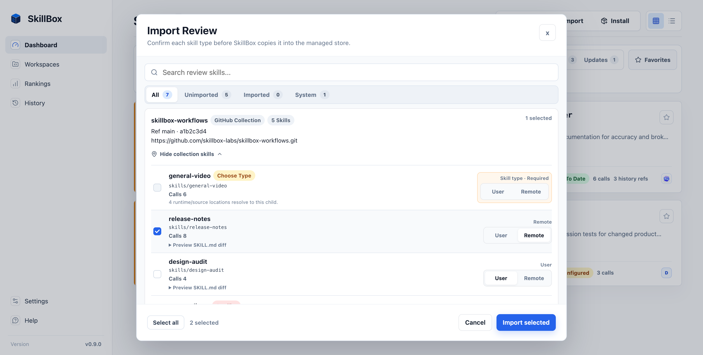

# SkillBox

> Local-first skill management for `SKILL.md` agent runtimes.

English | [简体中文](README.zh-CN.md)

[Website](https://santosli.github.io/SkillBox/) | [Releases](https://github.com/santosli/SkillBox/releases/latest) | [GitHub](https://github.com/santosli/SkillBox)


SkillBox is a local-first macOS desktop app with a Rust core and CLI for managing `SKILL.md`-based skill and capability packages without treating any supported agent runtime as the source of truth.

Current release: `v0.7.1`. SkillBox is useful today for local skill management, but it is still early software. Keep backups of important skills, and review each filesystem change before applying it.

## Promo Video

[](docs/promo/skillbox-intro/skillbox-promo.mp4)

A 30-second overview of SkillBox: runtime-aware workspaces, review-before-write safety, evidence-aware Calls, transparent coverage, and local-first deployment.

## Why

- **One managed store for supported runtimes.** Keep durable skill state in `~/.skillbox`, then deploy it into supported global or project-local `SKILL.md` roots.
- **Review the whole lifecycle.** Inspect imports, deployments, type changes, source bindings, updates, rollbacks, and deletion before SkillBox changes managed or runtime files.
- **Versioned remote skills.** Check GitHub sources while SkillBox is open, preview all-file diffs, apply updates, and roll back to immutable versions.
- **Reviewed Git changes in both directions.** Inspect local user-skill diffs before commit/push. The shipped v0.7 line adds an explicit Check remote -> Review incoming changes -> Apply fast-forward flow for safe inbound updates; diverged history remains a normal Git conflict to resolve outside SkillBox.
- **Evidence-aware Calls, references, and operation history.** Count locally confirmed executions plus defensible structured invocations as Calls, keep lower-signal history references separate, and explain coverage without storing full chat transcripts.
- **Safe storage and deployment defaults.** Use ordered SQLite migrations, recovery backups, integrity checks, and ownership-checked symlinks instead of silently overwriting runtime content.
- **Git-backed local collections.** Import Review groups skills from the same local Git worktree into one repository card while keeping each child independently selectable, deployable, and usage-tracked. GitHub multi-skill fetch and collection-level update/rollback remain future work.
- **Installed-source provenance.** Copied skills with valid v3 installer lockfile entries can appear under one normalized GitHub source collection even without a local Git worktree. This is display-only provenance: it does not invent a branch/HEAD or enable updates, and each child keeps the normal reviewed import path.
- **Compatibility before deployment.** Rust-owned runtime profiles identify each workspace and report preserved frontmatter warnings or hard blockers before a confirmed symlink deployment.
- **Signed macOS distribution.** Install a notarized DMG or Homebrew cask and apply signed app updates only after confirmation.

## Screenshots


The dashboard provides local search, type/update/tag/favorite filters, grid and list views, and status-focused cards. The skill detail view collects workspace deployment, usage, version history, source binding, rollback, tags, type changes, and reviewed deletion in one place.


The Workspaces view tracks profile-aware global and project-local `SKILL.md` roots for Agents, Codex, Claude Code, Cursor, and exact custom folders. Search by workspace name, path, or profile and combine the query with the existing scope filters.


Rankings keeps Top skills and the full ranking primary. Its optional coverage disclosure separates confirmed and defensible inferred Calls from lower-signal History references, and reports the local provider scan boundary without presenting account analytics.


History separates Calls, history references, and management operations. The standalone Rankings page shows 7-day, 30-day, or all-time **Calls** filtered by skill type (User, Remote, or System), Agent, or Workspace. Calls combine locally confirmed executions with defensible structured per-turn invocations; references never increase Calls or default ranking order. Rankings keep same-name regular and System skills separate and use the observed source when preparing an import. Coverage reports confirmed, inferred, and reference totals, their time ranges, retained provenance sources, and the latest provider scan totals.

`Sync histories` imports auditable usage evidence from Codex, Claude Code, and Cursor without copying chat bodies. Codex per-turn `<skill>` blocks or `[$skill](.../SKILL.md)` links with an absolute path are inferred Calls, not provider-confirmed runs; catalog entries, prose, shell/tool payloads, and outputs are excluded. Claude Code native Skill tool/command attribution is confirmed after resolving a real `SKILL.md`. Cursor state `context.cursorRules` entries are references. A structured assistant `Read` of an absolute local `SKILL.md` in a bounded Cursor agent transcript is an inferred Call, deduplicated once per transcript user turn and skill. Safe historical paths remain auditable after the file is moved or deleted, but never become filesystem or deployment authority; `ReadFile` candidates are reported diagnostically and excluded from Calls until their semantics are qualified. Repeated scans are idempotent and stronger evidence upgrades an existing event without losing provenance. Codex local stores do not expose a stable provider-native run total, so local Calls remain a known undercount rather than account analytics. An explicit sync can recover or upgrade evidence; database migration itself does not rescan histories.



GitHub installs and workspace deployments use a preview-first flow. SkillBox shows incoming file changes and runtime-profile compatibility before writing managed state; blocked targets cannot proceed, and warnings require explicit confirmation.

## What SkillBox Manages

SkillBox keeps its managed store under `~/.skillbox` by default:

```text
~/.skillbox/
  user-skills/
    <skill-name>/
      SKILL.md
  remote-skills/
    <skill-name>/
      source.json
      current -> versions/<version>
      versions/
        <version>/
          SKILL.md
  backups/
  skillbox.sqlite
```

Runtime directories are deployment targets:

- `~/.codex/skills`
- `~/.agents/skills`
- `~/.claude/skills`
- `~/.cursor/skills`
- project-local `.codex/skills`
- project-local `.agents/skills`
- project-local `.claude/skills`
- project-local `.cursor/skills`

Longer-term support for native Claude, OpenClaw, Cursor, Claude Code, Copilot, and other non-`SKILL.md` formats should go through explicit agent adapters rather than hard-coded UI behavior.

## Features

- Scan and register supported global or project-local `SKILL.md` workspaces. In the packaged macOS app, use the native single-directory picker or enter a path manually to choose a project or existing skills folder; SkillBox immediately runs a read-only preview, and can explicitly create exactly one selected `.agents/skills`, `.codex/skills`, `.claude/skills`, or `.cursor/skills` root before registration. Cancelling the picker changes nothing, and SkillBox never creates all runtime roots automatically.
- Review user, remote, and system import candidates before copying anything; the review shell opens immediately with staged scan progress, then shows one card per skill, every location and differing variant, and exactly one reviewed source without changing equivalent copies.
- Install GitHub-backed skills through a preview/apply flow and bind discovered remote source candidates without replacing the active version.
- Check remote sources, preview all-file diffs, apply updates, and roll back to immutable versions.
- Preview runtime-profile and frontmatter compatibility before deploying to an individual workspace. Blocked targets cannot be selected, warnings require confirmation, and apply revalidates stale skill/target/profile state before creating an ownership-checked symlink.
- Delete a skill from the managed store and all associated workspaces after a name-confirmed preview, while retaining a recovery backup and workspace registrations.
- Review user-skill Git diffs, create selected-file Conventional Commits, and optionally push. The v0.7 flow handles incoming `origin/main` changes through separate preview-confirmed fast-forward steps; SkillBox never auto-merges, rebases, resets, stashes, or resolves conflicts.
- During local Import Review, Rust detects the nearest safe Git worktree and presents its `SKILL.md` children as one collection. Collection scans are read-only; applying selected children rechecks the reviewed worktree/HEAD and stores collection provenance after the import succeeds.
- Search and filter the dashboard by type, update status, tag, or favorite; switch between grid and list views, with favorites and tags persisted in SQLite.
- Record supported hooks and structured local-history evidence; browse Calls separately from History references, rank by confirmed plus defensible inferred Calls, and inspect aggregate-only coverage without storing full transcripts.
- Apply ordered SQLite migrations with pre-migration backups and integrity checks; run Doctor diagnostics and explicitly clean up stale deployment records.
- Check signed GitHub Releases in the background at most once per day, show an Update action when a new macOS build is available, and install only after the user clicks it.

## Requirements

- macOS 14 Sonoma or newer
- Git, for user-skill sync and remote skill workflows
- An agent runtime that uses `SKILL.md` directories

Windows, Linux, and a Homebrew CLI formula are not part of the current release.

## Public website telemetry

The public SkillBox website uses optional VibeLoft page-view telemetry only after a visitor opts in. The website integration is separate from the macOS app and CLI: it cannot access managed skills, prompts, runtime folders, or the local SkillBox database. See the [website privacy notice](https://santosli.github.io/SkillBox/privacy.html) for the transmitted fields and opt-out controls.

## Install

### GitHub Releases

Download the signed and notarized DMG from:

https://github.com/santosli/SkillBox/releases

For this release, use the asset named:

```text
SkillBox_0.7.1_universal.dmg
```

The matching checksum is published as:

```text
SkillBox_0.7.1_universal.dmg.sha256
```

Open the DMG and drag `SkillBox.app` into `/Applications`.

DMG installs check signed GitHub Releases in the background at most once per
day. When a new version is available, use the Update action beside the SkillBox
brand for a direct signed install and restart, or review release notes in
Settings -> App updates. SkillBox never downloads or installs an app update
without a click.

### Homebrew

The cask uses the project tap instead of the official Homebrew Cask repository:

```sh
brew tap santosli/tap
brew install --cask skillbox
```

Upgrade with:

```sh
brew upgrade --cask skillbox
```

Uninstall with:

```sh
brew uninstall --cask skillbox
```

Homebrew uninstall does not delete `~/.skillbox`.

## First Run

1. Open SkillBox.
2. Run `Scan` to discover known global and project-local skill workspaces, or use `Add workspace` to choose one local project or skills folder with the packaged app's native directory picker. You can still enter an absolute path manually. A selection immediately opens the read-only setup preview; cancelling the picker has no effect. Confirm only if you want to register an existing root or create the one selected supported project-local root.
3. Use `Import` to review candidates before SkillBox copies them into `~/.skillbox`.
4. Use `Install` to preview GitHub-backed remote skills, then confirm before SkillBox copies them into the managed store. SkillBox accepts standalone repository URLs with a root `SKILL.md`, root `SKILL.md` file URLs, and skill directory URLs. Repository-root snapshots exclude Git metadata.
5. Deploy managed skills to selected runtime workspaces when you want an agent to use them.
6. Optional: enable usage hook injection in Settings to add confirmed local execution evidence. Without complete hook/provider coverage, Calls remain a local lower bound.

## Permissions And Local Changes

SkillBox is local-first and does not require a hosted account. The app may:

- scan known runtime directories for `SKILL.md` folders;
- write managed copies and metadata under `~/.skillbox`;
- create symlinks from runtime directories back to managed skills;
- initialize and update Git metadata for `~/.skillbox/user-skills`;
- in the v0.7 flow, explicitly fetch and preview incoming `origin/main` changes, then fast-forward the shared user-skills repository only after confirmation;
- modify supported runtime hook config files when you explicitly inject hooks.

SkillBox treats runtime folders, GitHub URLs, downloaded archives, and existing skills as untrusted input. It should not silently overwrite a non-symlink runtime target.

## Uninstall And Reset

See [docs/uninstall-reset.md](docs/uninstall-reset.md) for removing the app, reverting hook injection, deleting runtime symlinks, and optionally removing the managed store.

## Architecture

```text
React desktop UI
  -> Tauri commands
  -> skillbox-core / skillbox-github / skillbox-git
  -> local filesystem, SQLite, Git, and structured GitHub source metadata
```

Workspace layout:

```text
apps/desktop/              Tauri + React desktop app
apps/desktop/src-tauri/    Tauri command bridge
crates/skillbox-core/      managed skill lifecycle, safety, SQLite, workspaces, history, hooks, and Git sync
crates/skillbox-github/    GitHub skill URL parsing and normalization
crates/skillbox-git/       structured Git service boundary
crates/skillbox-cli/       Rust CLI
docs/                      architecture, data model, workflows, ADRs
```

New core business logic should go into Rust crates. React should call structured Tauri commands instead of owning filesystem, Git, GitHub download, migration, or rollback behavior.

## Docs

- [Roadmap](docs/roadmap.md)
- [Good first issues](docs/good-first-issues.md)
- [Architecture](docs/architecture.md)
- [Data model](docs/data-model.md)
- [Workflows](docs/workflows.md)
- [CLI and Desktop capability matrix](docs/workflows.md#18-cli-and-desktop-capability-matrix)
- [Implementation status](docs/implementation-status.md)
- [Contributing](CONTRIBUTING.md)
- [Managed store ADR](docs/decisions/0001-managed-store-is-source-of-truth.md)
- [Symlink deployment ADR](docs/decisions/0002-symlink-deployment-by-default.md)
- [Rust core migration ADR](docs/decisions/0003-migrate-node-cli-behavior-to-rust-core.md)
- [Agent adapter ADR](docs/decisions/0004-support-multiple-agent-runtimes-through-adapters.md)
- [Usage evidence ADR](docs/decisions/0005-usage-evidence-classification.md)
- [Reviewed inbound Git ADR](docs/decisions/0006-review-inbound-user-skills-git-before-fast-forward.md)
- [Git-backed Skill Collections ADR](docs/decisions/0007-git-backed-skill-collections.md)

## Development

See [CONTRIBUTING.md](CONTRIBUTING.md) for local setup, test commands, release invariants, and contribution guidelines.
New contributors can start with [Good first issues](docs/good-first-issues.md)
or the public [Roadmap](docs/roadmap.md).

Useful commands:

```sh
npm test
cargo test --offline
npm --workspace apps/desktop run build
npm run docs:check-staged
```

For UI changes, also run the Vite or Tauri app and verify the affected screen manually.

## License

SkillBox is available under the [MIT License](LICENSE).
