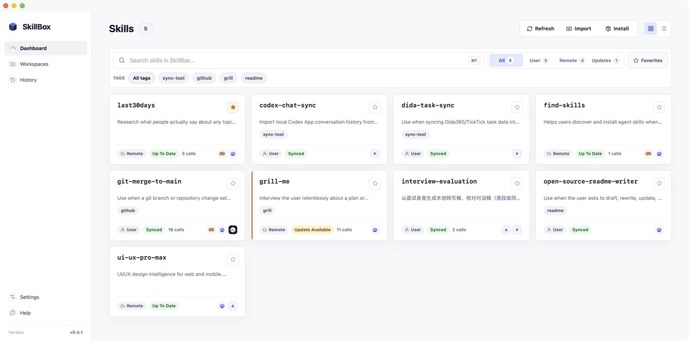
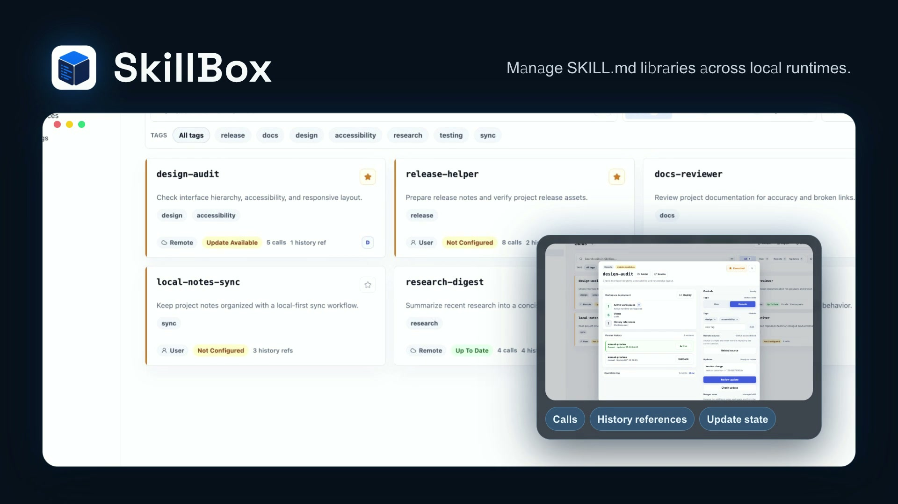
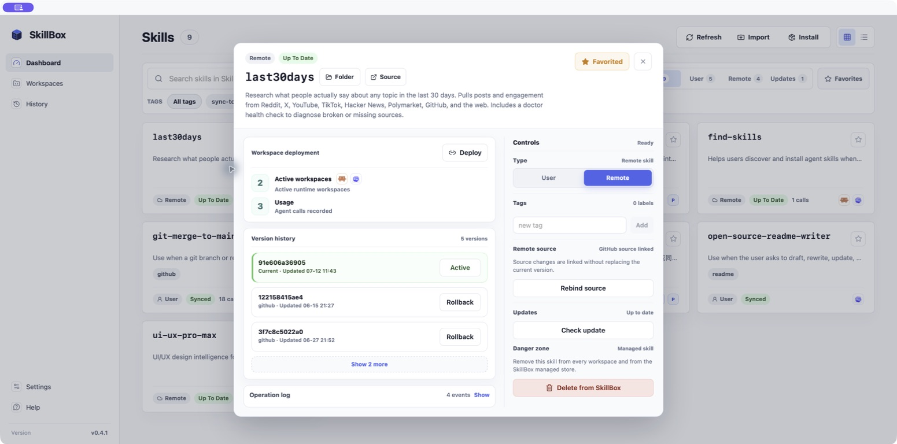
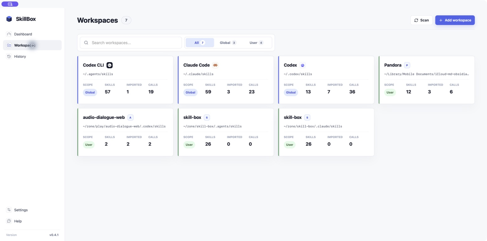
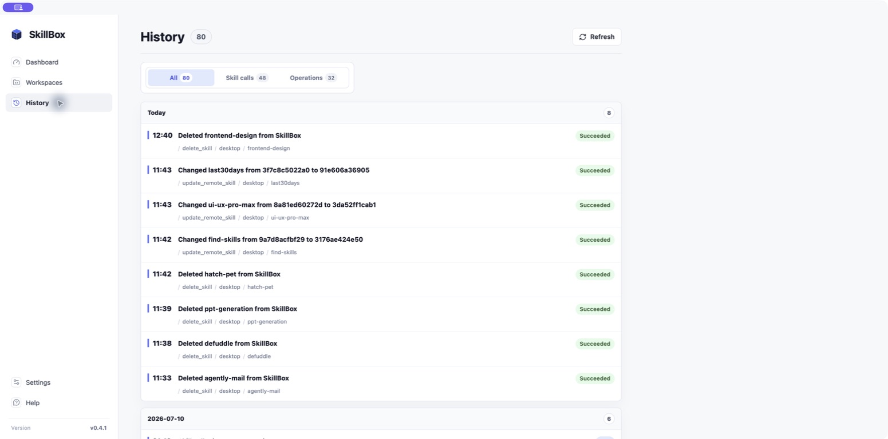
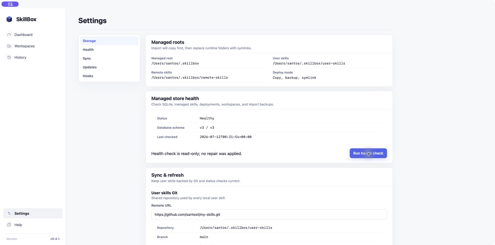
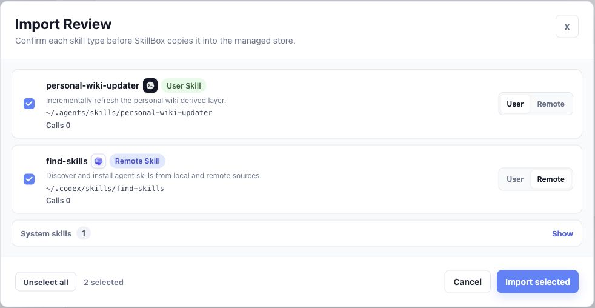

# SkillBox

> Local-first skill management for `SKILL.md` agent runtimes.

English | [简体中文](README.zh-CN.md)

[Website](https://santosli.github.io/SkillBox/) | [Releases](https://github.com/santosli/SkillBox/releases/latest) | [GitHub](https://github.com/santosli/SkillBox)




SkillBox is a local-first macOS desktop app with a Rust core and CLI for managing `SKILL.md`-based skill and capability packages without treating any supported agent runtime as the source of truth.

Current release: `v0.5.1`. SkillBox is useful today for local skill management, but it is still early software. Keep backups of important skills, and review each filesystem change before applying it.

## Promo Video

[](docs/promo/skillbox-intro/skillbox-promo.mp4)

A 30-second overview of SkillBox: local-first skill management, review-before-import, remote updates, usage history, and GitHub-backed releases.

## Why

- **One managed store for supported runtimes.** Keep durable skill state in `~/.skillbox`, then deploy it into supported global or project-local `SKILL.md` roots.
- **Review the whole lifecycle.** Inspect imports, deployments, type changes, source bindings, updates, rollbacks, and deletion before SkillBox changes managed or runtime files.
- **Versioned remote skills.** Check GitHub sources while SkillBox is open, preview all-file diffs, apply updates, and roll back to immutable versions.
- **Reviewed Git commit and push.** Inspect user-skill diffs, create a Conventional Commit, and optionally push it; inbound divergence remains a normal Git conflict to resolve outside SkillBox.
- **Locally observed calls, local rankings, and operation history.** Record supported agent hook calls, rank skills by the calls SkillBox can observe on this Mac, and show those calls beside management operations without storing full chat transcripts.
- **Safe storage and deployment defaults.** Use ordered SQLite migrations, recovery backups, integrity checks, and ownership-checked symlinks instead of silently overwriting runtime content.
- **Signed macOS distribution.** Install a notarized DMG or Homebrew cask and apply signed app updates only after confirmation.

## Screenshots



The dashboard provides local search, type/update/tag/favorite filters, grid and list views, and status-focused cards. The skill detail view collects workspace deployment, usage, version history, source binding, rollback, tags, type changes, and reviewed deletion in one place.



The Workspaces view tracks global and project-local `SKILL.md` roots across Codex CLI, Codex App, Claude Code skill folders, and project-specific runtimes. Search by workspace name, path, or agent and combine the query with Global/User filters.



History combines locally observed skill calls and management operations. The standalone Rankings page shows 7-day, 30-day, or all-time **Locally observed calls** filtered by skill type (User, Remote, or System), Agent, or Workspace. Rankings keep same-name regular and System skills separate and use the observed source when preparing an import. Coverage reports the earliest and latest observed event, canonical stored-origin counts for hooks and each supported local-history provider, plus the session count from the latest scans.

`Sync histories` imports auditable usage evidence from Codex, Claude Code, and Cursor without copying chat bodies. Codex accepts explicit user-input `<skill>` blocks or `[$skill](.../SKILL.md)` links only when they contain an absolute `SKILL.md` path, so pasted code templates and placeholders are ignored. Claude Code accepts its structured Skill tool/command attribution and resolves it to a real `SKILL.md`. Cursor uses only explicitly attached `context.cursorRules` entries pointing to a real `SKILL.md`; its private SQLite schema is validated and opened read-only, and unsupported versions fail closed. Repeated scans are idempotent. These local observations are not a global popularity or trust score. Provider-reported analytics remain separate and are never merged into local ranking, total, or delta values.



Doctor checks the SQLite schema and integrity, managed skills, deployments, workspaces, and import backups. Diagnostics are read-only; stale deployment records require an explicit repair action.



Import review keeps local scans explicit: candidates are classified before SkillBox copies them into the managed store. Copies with identical imported contents across multiple runtime roots are grouped into one review row while retaining every source location for review; only the primary source is imported, other copies remain unchanged, and skills with different scripts or assets remain separate.

## What SkillBox Manages

SkillBox keeps its managed store under `~/.skillbox` by default:

```text
~/.skillbox/
  user-skills/
    <skill-name>/
      SKILL.md
  remote-skills/
    <skill-name>/
      source.json
      current -> versions/<version>
      versions/
        <version>/
          SKILL.md
  backups/
  skillbox.sqlite
```

Runtime directories are deployment targets:

- `~/.codex/skills`
- `~/.agents/skills`
- `~/.claude/skills`
- project-local `.codex/skills`
- project-local `.agents/skills`
- project-local `.claude/skills`

Longer-term support for native Claude, OpenClaw, Cursor, Claude Code, Copilot, and other non-`SKILL.md` formats should go through explicit agent adapters rather than hard-coded UI behavior.

## Features

- Scan and register supported global or project-local `SKILL.md` workspaces. In the packaged macOS app, use the native single-directory picker or enter a path manually to choose a project or existing skills folder; SkillBox immediately runs a read-only preview, and can explicitly create exactly one selected `.agents/skills`, `.codex/skills`, or `.claude/skills` root before registration. Cancelling the picker changes nothing, and SkillBox never creates all runtime roots automatically.
- Review user, remote, and system import candidates before copying anything; group import-equivalent multi-root copies without losing their source locations, and conservatively revert eligible deploy-back imports.
- Install GitHub-backed skills through a preview/apply flow and bind discovered remote source candidates without replacing the active version.
- Check remote sources, preview all-file diffs, apply updates, and roll back to immutable versions.
- Deploy or remove managed skills in individual workspaces through ownership-checked symlinks; migrate User/Remote ownership and retarget deployments through a reviewed flow.
- Delete a skill from the managed store and all associated workspaces after a name-confirmed preview, while retaining a recovery backup and workspace registrations.
- Review user-skill Git diffs, create selected-file Conventional Commits, and optionally push without attempting an inbound auto-merge.
- Search and filter the dashboard by type, update status, tag, or favorite; switch between grid and list views, with favorites and tags persisted in SQLite.
- Record supported Codex App, Codex CLI, and Claude Code CLI hook calls; browse **Locally observed calls** beside management operations and rank skills locally by time range, Agent, or Workspace without storing full transcripts.
- Apply ordered SQLite migrations with pre-migration backups and integrity checks; run Doctor diagnostics and explicitly clean up stale deployment records.
- Check signed GitHub Releases in the background at most once per day, show an Update action when a new macOS build is available, and install only after the user clicks it.

## Requirements

- macOS 14 Sonoma or newer
- Git, for user-skill sync and remote skill workflows
- An agent runtime that uses `SKILL.md` directories

Windows, Linux, and a Homebrew CLI formula are not part of the current release.

## Public website telemetry

The public SkillBox website uses optional VibeLoft page-view telemetry only after a visitor opts in. The website integration is separate from the macOS app and CLI: it cannot access managed skills, prompts, runtime folders, or the local SkillBox database. See the [website privacy notice](https://santosli.github.io/SkillBox/privacy.html) for the transmitted fields and opt-out controls.

## Install

### GitHub Releases

Download the signed and notarized DMG from:

https://github.com/santosli/SkillBox/releases

For this release, use the asset named:

```text
SkillBox_0.5.1_universal.dmg
```

The matching checksum is published as:

```text
SkillBox_0.5.1_universal.dmg.sha256
```

Open the DMG and drag `SkillBox.app` into `/Applications`.

DMG installs check signed GitHub Releases in the background at most once per
day. When a new version is available, use the Update action beside the SkillBox
brand for a direct signed install and restart, or review release notes in
Settings -> App updates. SkillBox never downloads or installs an app update
without a click.

### Homebrew

The cask uses the project tap instead of the official Homebrew Cask repository:

```sh
brew tap santosli/tap
brew install --cask skillbox
```

Upgrade with:

```sh
brew upgrade --cask skillbox
```

Uninstall with:

```sh
brew uninstall --cask skillbox
```

Homebrew uninstall does not delete `~/.skillbox`.

## First Run

1. Open SkillBox.
2. Run `Scan` to discover known global and project-local skill workspaces, or use `Add workspace` to choose one local project or skills folder with the packaged app's native directory picker. You can still enter an absolute path manually. A selection immediately opens the read-only setup preview; cancelling the picker has no effect. Confirm only if you want to register an existing root or create the one selected supported project-local root.
3. Use `Import` to review candidates before SkillBox copies them into `~/.skillbox`.
4. Use `Install` to preview GitHub-backed remote skills, then confirm before SkillBox copies them into the managed store. SkillBox accepts standalone repository URLs with a root `SKILL.md`, root `SKILL.md` file URLs, and skill directory URLs. Repository-root snapshots exclude Git metadata.
5. Deploy managed skills to selected runtime workspaces when you want an agent to use them.
6. Optional: enable usage hook injection in Settings to record real skill calls.

## Permissions And Local Changes

SkillBox is local-first and does not require a hosted account. The app may:

- scan known runtime directories for `SKILL.md` folders;
- write managed copies and metadata under `~/.skillbox`;
- create symlinks from runtime directories back to managed skills;
- initialize and update Git metadata for `~/.skillbox/user-skills`;
- modify supported runtime hook config files when you explicitly inject hooks.

SkillBox treats runtime folders, GitHub URLs, downloaded archives, and existing skills as untrusted input. It should not silently overwrite a non-symlink runtime target.

## Uninstall And Reset

See [docs/uninstall-reset.md](docs/uninstall-reset.md) for removing the app, reverting hook injection, deleting runtime symlinks, and optionally removing the managed store.

## Architecture

```text
React desktop UI
  -> Tauri commands
  -> skillbox-core / skillbox-github / skillbox-git
  -> local filesystem, SQLite, Git, and structured GitHub source metadata
```

Workspace layout:

```text
apps/desktop/              Tauri + React desktop app
apps/desktop/src-tauri/    Tauri command bridge
crates/skillbox-core/      managed skill lifecycle, safety, SQLite, workspaces, history, hooks, and Git sync
crates/skillbox-github/    GitHub skill URL parsing and normalization
crates/skillbox-git/       structured Git service boundary
crates/skillbox-cli/       Rust CLI
docs/                      architecture, data model, workflows, ADRs
```

New core business logic should go into Rust crates. React should call structured Tauri commands instead of owning filesystem, Git, GitHub download, migration, or rollback behavior.

## Docs

- [Roadmap](docs/roadmap.md)
- [Good first issues](docs/good-first-issues.md)
- [Architecture](docs/architecture.md)
- [Data model](docs/data-model.md)
- [Workflows](docs/workflows.md)
- [Implementation status](docs/implementation-status.md)
- [Contributing](CONTRIBUTING.md)
- [Managed store ADR](docs/decisions/0001-managed-store-is-source-of-truth.md)
- [Symlink deployment ADR](docs/decisions/0002-symlink-deployment-by-default.md)
- [Rust core migration ADR](docs/decisions/0003-migrate-node-cli-behavior-to-rust-core.md)
- [Agent adapter ADR](docs/decisions/0004-support-multiple-agent-runtimes-through-adapters.md)

## Development

See [CONTRIBUTING.md](CONTRIBUTING.md) for local setup, test commands, release invariants, and contribution guidelines.
New contributors can start with [Good first issues](docs/good-first-issues.md)
or the public [Roadmap](docs/roadmap.md).

Useful commands:

```sh
npm test
cargo test --offline
npm --workspace apps/desktop run build
npm run docs:check-staged
```

For UI changes, also run the Vite or Tauri app and verify the affected screen manually.

## License

SkillBox is available under the [MIT License](LICENSE).
