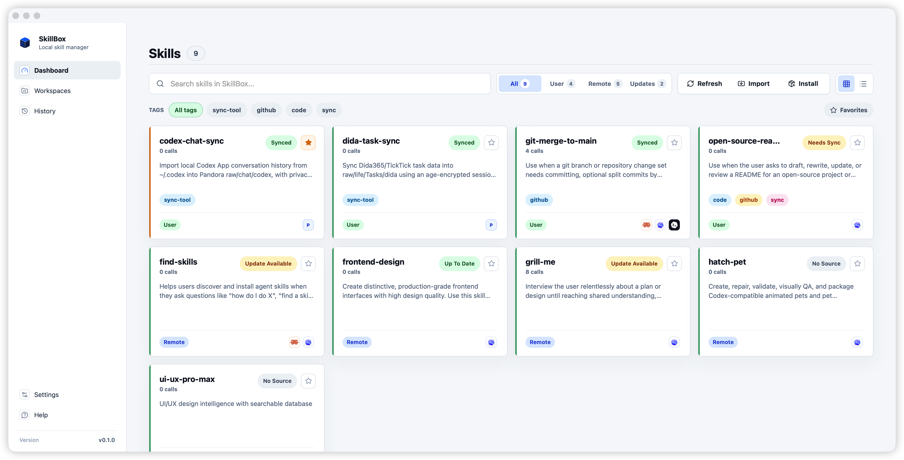
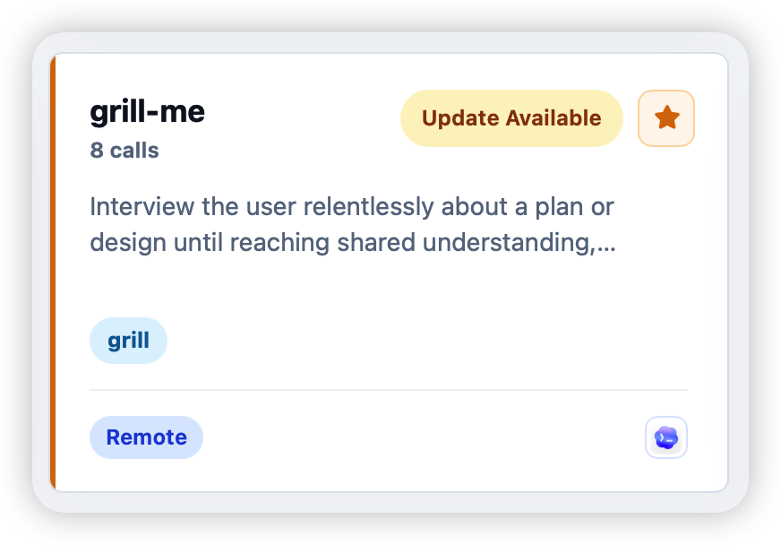
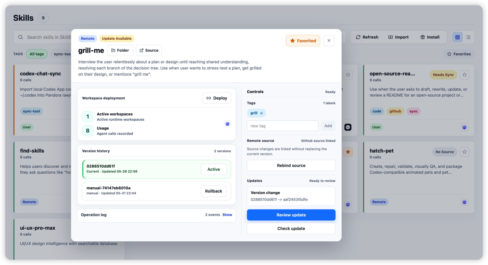
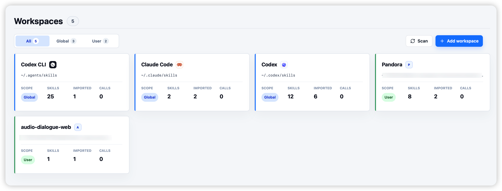
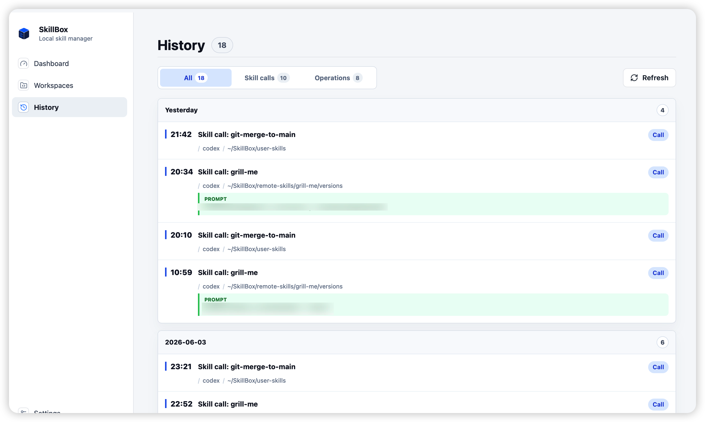
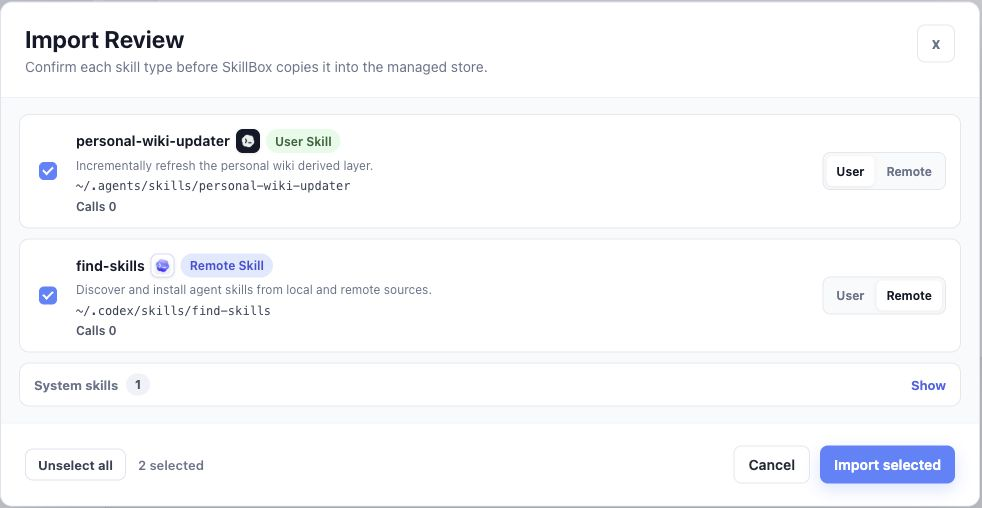

# SkillBox

> 管理本地多个 agent runtime 中的 skills。

[English](README.md) | 简体中文




SkillBox 是一个 local-first 的 macOS 应用和 CLI，用来管理基于 `SKILL.md` 的 skills、规则、提示词和能力包，同时避免把某一个 agent runtime 当作唯一真相源。

Public alpha 状态：SkillBox 现在已经可以用于本地 skill 管理，但仍是早期软件。重要 skills 请保留备份，并在应用每一次文件系统变更前先 review。

## 为什么

- **一个 managed store，面向多个 runtime。** 把持久 skill 状态放在 `~/.skillbox`，再按需部署到各个 agent runtime。
- **本地 skills 一键同步。** 在桌面应用里直接提交并推送 user skill 变更，不需要离开 SkillBox。
- **远程 skills 定时检查。** 自动刷新 remote skill 状态，有可用更新时先 review，再应用。
- **统计真实 skill 调用。** 通过支持的 agent hooks 记录 skill 调用，并在卡片和 History 里展示调用次数。
- **远程 skill 版本管理。** 预览 diff、应用更新，并能回滚到不可变的 remote skill 版本。
- **导入前先审查。** 本地扫描候选会先被分类为 user、remote 或 system，然后 SkillBox 才会复制内容。
- **安全的默认部署。** 默认用 symlink 部署，并拒绝静默覆盖 runtime 中已有内容。

## 截图



Skill card 会把调用次数、更新状态、标签、收藏状态和已部署 runtime target 放在同一个卡片里，方便快速判断维护状态。



详情页集中展示 workspace 部署、调用统计、版本历史、source 绑定、更新 review、rollback、标签和 operation history。



Workspaces 视图会跟踪全局和项目局部 skill roots，包括 Codex CLI、Claude Code、Codex App 和项目自己的 runtime。



History 会把真实 skill 调用和管理操作合并展示，prompt 只保留经过压缩和脱敏的小片段。



Import review 让本地扫描结果保持显式可审查：候选项会先完成分类，然后 SkillBox 才会把它们复制进 managed store。

## SkillBox 管什么

SkillBox 默认把 managed store 放在 `~/.skillbox`：

```text
~/.skillbox/
  user-skills/
    <skill-name>/
      SKILL.md
  remote-skills/
    <skill-name>/
      source.json
      current -> versions/<version>
      versions/
        <version>/
          SKILL.md
  backups/
  skillbox.sqlite
```

Runtime 目录只是部署目标：

- `~/.codex/skills`
- `~/.agents/skills`
- `~/.claude/skills`
- 项目局部 `.codex/skills`
- 项目局部 `.agents/skills`
- 项目局部 `.claude/skills`

后续支持 Claude、OpenClaw、Cursor、Claude Code、Copilot 和其它原生格式时，应通过明确的 agent adapter 表达，而不是把 agent-specific 行为硬编码在 UI 里。

## 功能

- 扫描本地 `SKILL.md` roots，返回按名称排序的 skills、frontmatter 元数据、content hash、symlink 状态和扫描错误。
- 把既有本地 skills 导入到 `~/.skillbox/user-skills` 或 `~/.skillbox/remote-skills`。
- 通过 symlink 把 managed skills 部署到 runtime 目录，也支持 undeploy。
- 解析指向 skill 目录或 `SKILL.md` 的 GitHub tree、blob、raw 和 contents API URL。
- 跟踪远程 GitHub source，检查更新，预览全文件 diff，应用更新，并回滚到不可变版本。
- 管理全局和项目局部 runtime 的 workspace roots。
- 通过共享 Git 仓库同步 user skills，并在桌面端提供 diff review 和 Conventional Commit message 生成。
- 通过 Codex App、Codex CLI、Claude Code CLI hooks 记录 usage events，但不保存完整聊天正文。
- 从 SQLite 记录中浏览桌面 operation 和 usage history。

## 依赖

- macOS 14 Sonoma 或更新版本
- Git，用于 user-skill sync 和 remote skill workflows
- 使用 `SKILL.md` 目录的 agent runtime

Windows、Linux 和 Homebrew CLI formula 不属于 public alpha 范围。

## 安装

### GitHub Releases

从 GitHub Releases 下载已签名并公证的 DMG：

https://github.com/santosli/skill-box/releases

本次 alpha 使用这个 asset：

```text
SkillBox_0.1.0-alpha.2_universal.dmg
```

对应 checksum：

```text
SkillBox_0.1.0-alpha.2_universal.dmg.sha256
```

打开 DMG，把 `SkillBox.app` 拖到 `/Applications`。

### Homebrew

Public alpha 使用项目自己的 tap，而不是官方 Homebrew Cask 仓库：

```sh
brew tap santosli/tap
brew install --cask skillbox
```

升级：

```sh
brew upgrade --cask skillbox
```

卸载：

```sh
brew uninstall --cask skillbox
```

Homebrew uninstall 不会删除 `~/.skillbox`。

## 首次使用

1. 打开 SkillBox。
2. 点击 `Scan` 发现已知的全局和项目局部 skill workspaces。
3. 使用 `Import` 先 review 候选项，再让 SkillBox 复制到 `~/.skillbox`。
4. 把已导入 skills 部署到选定 runtime workspaces。
5. 可选：在 Settings 启用 usage hook injection，用来记录真实 skill 调用。

## 权限和本地变更

SkillBox 是 local-first，不需要托管账号。应用可能会：

- 扫描已知 runtime 目录中的 `SKILL.md` folders；
- 在 `~/.skillbox` 下写入 managed copies 和 metadata；
- 创建从 runtime 目录回指到 managed skills 的 symlink；
- 为 `~/.skillbox/user-skills` 初始化和更新 Git metadata；
- 在你明确注入 hooks 时，修改受支持 runtime 的 hook config files。

SkillBox 会把 runtime folders、GitHub URLs、下载归档和既有 skills 都视为不可信输入，不应静默覆盖非 symlink runtime target。

## 卸载和重置

见 [docs/uninstall-reset.md](docs/uninstall-reset.md)，其中包含删除应用、回滚 hook injection、删除 runtime symlinks，以及可选删除 managed store 的步骤。

## 架构

```text
React desktop UI
  -> Tauri commands
  -> skillbox-core / skillbox-github / skillbox-git
  -> local filesystem, SQLite, Git, and structured GitHub source metadata
```

Workspace 布局：

```text
apps/desktop/              Tauri + React desktop app
apps/desktop/src-tauri/    Tauri command bridge
crates/skillbox-core/      scan, import, deploy, SQLite, workspaces, updates, hooks
crates/skillbox-github/    GitHub skill URL parsing and normalization
crates/skillbox-git/       structured Git service boundary
crates/skillbox-cli/       Rust CLI
packages/skillbox-core/    legacy Node core
packages/skillbox-cli/     legacy Node CLI
docs/                      architecture, data model, workflows, ADRs
```

新增核心业务逻辑应进入 Rust crates。React 应调用结构化 Tauri commands，不应直接拥有文件系统、Git、GitHub 下载、迁移或回滚行为。

## 文档

- [Architecture](docs/architecture.md)
- [Data model](docs/data-model.md)
- [Workflows](docs/workflows.md)
- [Implementation status](docs/implementation-status.md)
- [Contributing](CONTRIBUTING.md)
- [Managed store ADR](docs/decisions/0001-managed-store-is-source-of-truth.md)
- [Symlink deployment ADR](docs/decisions/0002-symlink-deployment-by-default.md)
- [Rust core migration ADR](docs/decisions/0003-migrate-node-cli-behavior-to-rust-core.md)
- [Agent adapter ADR](docs/decisions/0004-support-multiple-agent-runtimes-through-adapters.md)

## 开发

本地 setup、测试命令、release invariants 和贡献规范见 [CONTRIBUTING.md](CONTRIBUTING.md)。

常用命令：

```sh
npm test
cargo test --offline
npm --workspace apps/desktop run build
npm run docs:check-staged
```

涉及 UI 变更时，也需要运行 Vite 或 Tauri app 并手动验证受影响页面。

## License

SkillBox 使用 [MIT License](LICENSE)。
