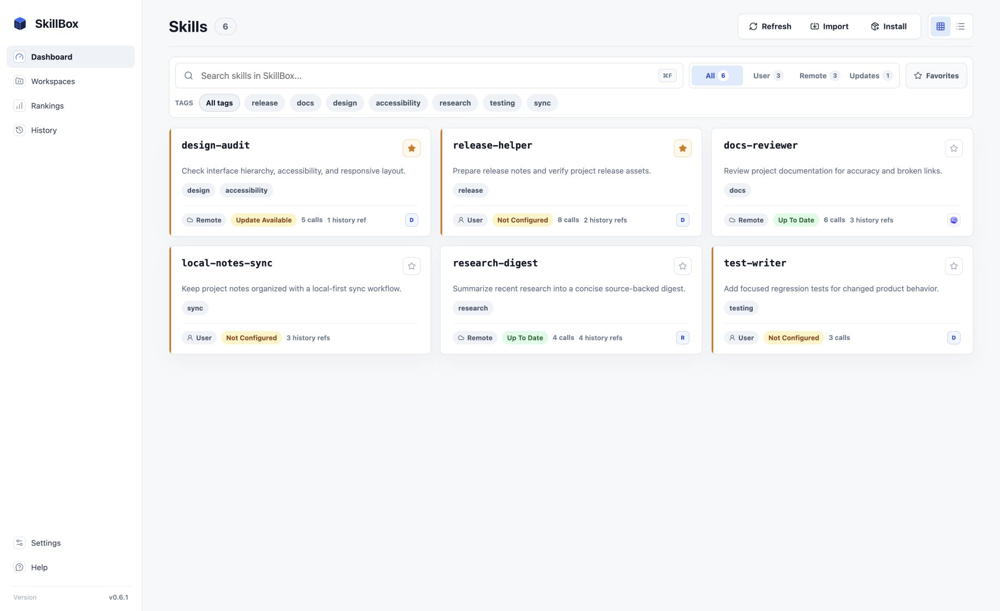
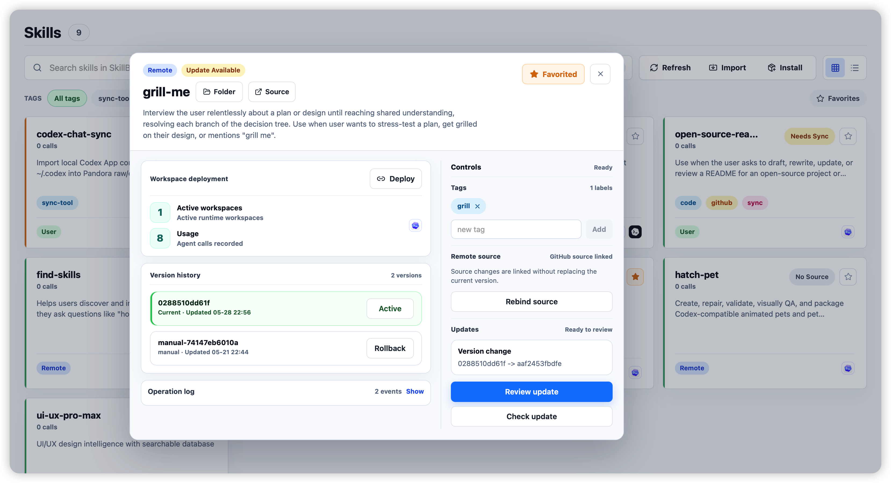
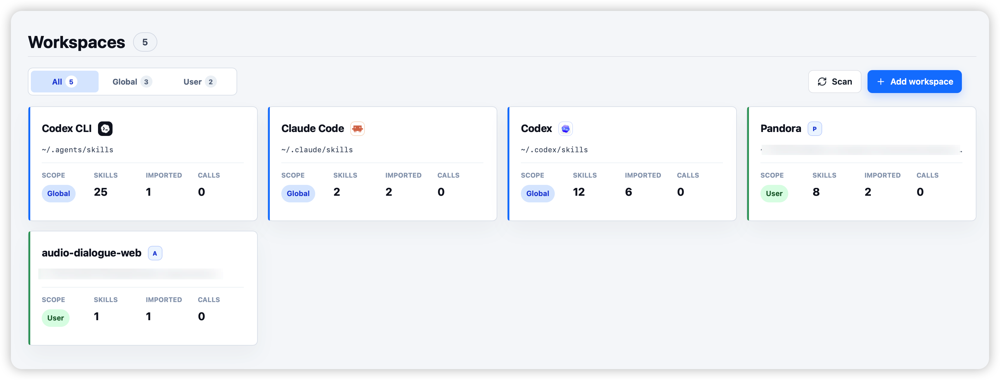
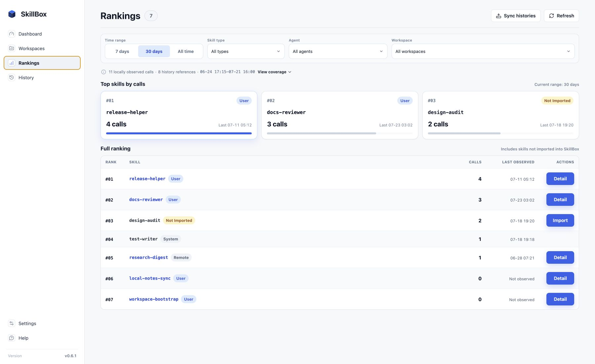
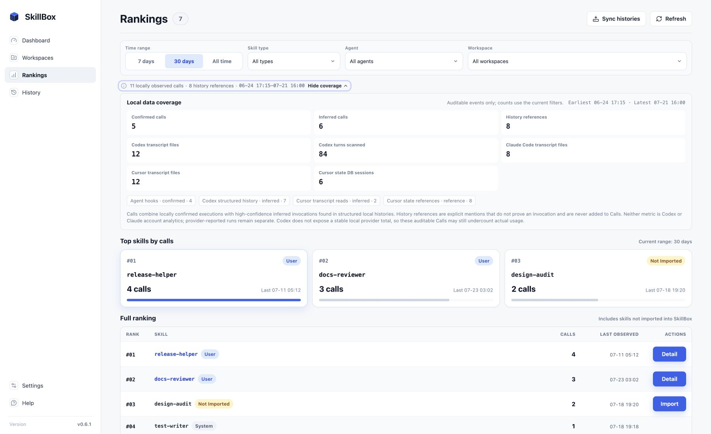
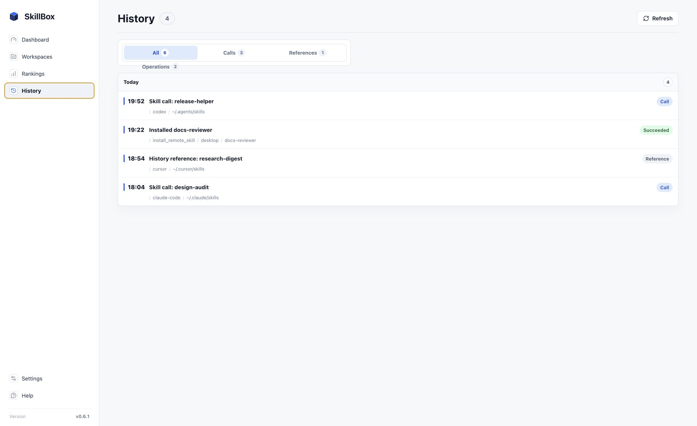
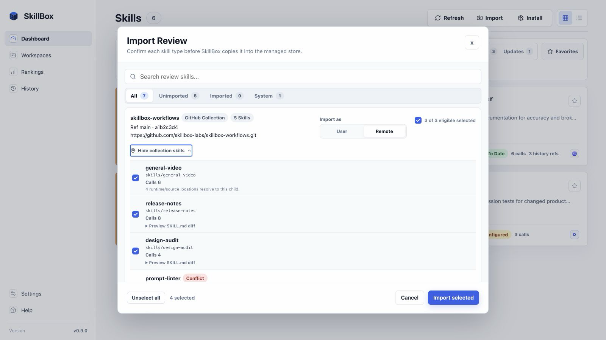

# SkillBox

> 管理本地 `SKILL.md` agent runtimes 中的 skills。

[English](README.md) | 简体中文

[官网](https://santosli.github.io/SkillBox/) | [最新版本](https://github.com/santosli/SkillBox/releases/latest) | [GitHub](https://github.com/santosli/SkillBox)




SkillBox 是一个 local-first 的 macOS 桌面应用，带 Rust core/CLI，用来管理基于 `SKILL.md` 的 skill 与能力包，同时避免把任一受支持的 agent runtime 当作唯一真相源。

当前版本：`v0.9.1`。SkillBox 现在已经可以用于本地 skill 管理，但仍是早期软件。重要 skills 请保留备份，并在应用每一次文件系统变更前先 review。GitHub 多 skill collection preview/apply 首次随 v0.9.0 发布；collection 级更新/回滚仍计划在后续 v0.9.x 实现。

## 宣传视频

[](docs/promo/skillbox-intro/skillbox-promo.mp4)

这段 30 秒视频展示 v0.9.0 的 SkillBox：runtime-aware workspaces、写入前 review、按证据分类的 Calls、透明 coverage 和 local-first 部署。Promo 保持为 v0.9.0 发布素材；当前 collection header workflow 见下方产品截图。

## 为什么

- **一个 managed store，面向受支持的 runtime。** 把持久 skill 状态放在 `~/.skillbox`，再部署到受支持的全局或项目局部 `SKILL.md` roots。
- **完整生命周期都先 review。** 导入、部署、类型迁移、source 绑定、更新、回滚和删除都会先展示影响，再改 managed store 或 runtime 文件。
- **远程 skill 版本管理。** SkillBox 打开期间检查 GitHub source，预览全文件 diff，应用更新，并回滚到不可变版本。
- **双向 Git 变更都先审查。** 本地 user-skill diff 会在 commit/push 前 review。已发布的 v0.7 增加显式的 Check remote -> Review incoming changes -> Apply fast-forward 入站流程；远端历史分叉仍在 SkillBox 外按正常 Git 冲突处理。
- **按证据分类的 Calls、引用与操作历史。** Calls 只统计本机 confirmed execution 与可辩护的 structured invocation，低信号 history references 单独展示，并且不保存完整聊天 transcript。
- **安全的存储与部署默认值。** 使用顺序 SQLite migrations、恢复备份、完整性检查和 ownership-checked symlink，不静默覆盖 runtime 内容。
- **Git-backed 本地与 GitHub Skill Collections。** Import Review 会把同一 Git worktree 或经 review 的 GitHub repository snapshot 中的 skills 聚合为一个 collection 卡片，同时保留每个 child 独立的导入、部署和 usage 边界。当前项目 UI 在 collection header 统一选择一次 User/Remote，并可一次选中或清除全部 eligible children；类型未决或混合时，必须先显式选择，collection selection/apply 才会开放。GitHub preview/apply 对一个有界 ref 只 fetch 一次，展示 resolved SHA 与 child 状态，绝不自动部署。Collection 级更新/回滚仍计划在后续 v0.9.x 实现。
- **已安装来源 provenance。** 没有本地 Git worktree、但拥有有效 v3 installer lockfile 条目的复制 skill，也可以按规范化 GitHub source 聚合展示。这只是来源展示，不会伪造 branch、HEAD 或更新权限；每个 child 仍走原有的逐 skill review/import 流程。
- **部署前检查 compatibility。** Rust-owned runtime profiles 标识 workspace，并在确认 symlink 部署前报告会原样保留的 frontmatter warnings 或 hard blockers。
- **签名的 macOS 分发。** 可安装已公证 DMG 或 Homebrew cask，app 更新也只在用户确认后应用。

## 截图



Dashboard 支持本地搜索、类型/更新/tag/favorite 过滤以及 grid/list 切换，并用状态优先的卡片展示结果。详情页集中展示 workspace 部署、调用统计、版本历史、source 绑定、rollback、标签、类型迁移和经审查的删除操作。



Workspaces 视图会按 profile 跟踪 Agents、Codex、Claude Code、Cursor 和 exact custom folder 的全局/项目局部 `SKILL.md` roots。可以按 workspace 名称、路径或 profile 搜索，并与 Global/Project 类型筛选组合使用。



Rankings 优先展示 Top skills 与完整排名。可展开的 coverage disclosure 会把 confirmed / 可辩护 inferred Calls 与低信号 History references 分开，并说明本机 provider scan 的统计边界，不把它包装成账户 analytics。





History 会分开展示 Calls、History references 和管理操作。独立的一级 Rankings 页面可查看 7 天、30 天或全部 **Calls**，并按 skill type（User、Remote、System）、Agent 或 Workspace 过滤。Calls 由本机 confirmed execution 与可辩护的 structured per-turn invocation 组成；reference 不增加 Calls，也不提升默认排名。同名普通/System skill 会保持独立，并在准备导入时使用该行实际观测到的来源。覆盖范围会展示 confirmed、inferred、reference totals、各自时间范围、保留的 provenance sources，以及最近一次 provider scan totals。

`Sync histories` 会从 Codex、Claude Code 和 Cursor 导入可审计的 usage evidence，但不复制聊天正文。Codex user turn 中含绝对路径的 `<skill>` 块或 `[$skill](.../SKILL.md)` 属于 inferred Calls，而不是 provider-confirmed run；catalog、普通 prose、shell/tool payload 和 output 都会排除。Claude Code 原生 Skill tool/command attribution 在解析到真实 `SKILL.md` 后属于 confirmed。Cursor state 的 `context.cursorRules` 只是 reference。有界 Cursor agent transcript 中 assistant 对绝对本机 `SKILL.md` 的结构化 `Read` 属于 inferred Call，并按 transcript user turn + skill 去重。文件后来移动或删除时，经过安全词法边界校验的历史路径仍可作为审计 evidence，但绝不成为文件系统或部署权限；`ReadFile` 仅进入诊断，在语义完成 qualification 前不计 Calls。重复扫描保持幂等，更强 evidence 会升级同一 event 并保留 provenance。Codex 本地 stores 没有稳定的 provider-native run total，因此 Calls 是已知可能 undercount 的本机下界，不是账户 analytics。migration 不会自动重扫 history；用户显式 sync 时可以恢复或升级 evidence。



GitHub install 与 workspace deploy 都先 preview。多 skill GitHub review 会在写入前展示一个 repository/ref 与一个 resolved SHA。当前项目 UI 通过 collection header 的一次 User/Remote 选择统一解析所有 actionable children，并且 collection checkbox 只会选择或清除 eligible children；imported、system、invalid、conflict 与其它 read-only children 都不会被改动。每个选中的 child 仍独立导入、部署和统计 usage，任何内容都不会自动部署。Collection 级更新/回滚目前尚未包含。

## SkillBox 管什么

SkillBox 默认把 managed store 放在 `~/.skillbox`：

```text
~/.skillbox/
  user-skills/
    <skill-name>/
      SKILL.md
  remote-skills/
    <skill-name>/
      source.json
      current -> versions/<version>
      versions/
        <version>/
          SKILL.md
  backups/
  skillbox.sqlite
```

Runtime 目录只是部署目标：

- `~/.codex/skills`
- `~/.agents/skills`
- `~/.claude/skills`
- `~/.cursor/skills`
- 项目局部 `.codex/skills`
- 项目局部 `.agents/skills`
- 项目局部 `.claude/skills`
- 项目局部 `.cursor/skills`

后续支持 Claude、OpenClaw、Cursor、Claude Code、Copilot 和其它非 `SKILL.md` 原生格式时，应通过明确的 agent adapter 表达，而不是把 agent-specific 行为硬编码在 UI 里。

## 功能

- 扫描并登记受支持的全局或项目局部 `SKILL.md` workspaces。在打包后的 macOS app 中，可以通过原生单目录选择器或手动输入路径选择 project / 现有 skills folder；SkillBox 会立即执行只读 preview，并可在登记前显式创建一个选中的 `.agents/skills`、`.codex/skills`、`.claude/skills` 或 `.cursor/skills` root。取消选择不会改变当前状态，也不会一次创建所有 runtime roots。
- 在复制前 review user、remote 和 system import candidates；review shell 会先立即打开并展示分阶段扫描进度，再按每个 skill 一张卡片展示所有位置和差异 variant；每个 skill 只导入一个明确选择的来源，不改动等价副本。
- 通过 preview/apply 安装 GitHub-backed skill，并在不替换当前版本的情况下绑定识别到的 remote source candidate。
- 检查 remote source、预览全文件 diff、应用更新，并回滚到不可变版本。
- 部署前 preview runtime profile 与 frontmatter compatibility；blocked target 不可选择，warning 需要确认，apply 会重新校验 skill/target/profile 是否 stale，再创建 ownership-checked symlink。
- 名称确认后，从 managed store 和全部关联 workspace 删除 skill，同时保留 recovery backup 和 workspace registrations。
- Review user-skill Git diff、为选中文件创建 Conventional Commit，并可选推送。v0.7 对 `origin/main` 入站更新使用独立的 preview-confirmed fast-forward 流程；SkillBox 不会自动 merge、rebase、reset、stash 或解决冲突。
- 本地 Import Review 由 Rust 找到最近的安全 Git worktree，并把其中的 `SKILL.md` children 展示为一个 collection。collection scan 只读；应用选中的 children 前会重新校验 worktree/HEAD，成功导入后才保存 collection provenance。
- 按类型、更新状态、tag 或 favorite 搜索过滤 Dashboard，在 grid/list 间切换，并把 favorites 与 tags 持久化到 SQLite。
- 记录受支持的 hooks 与 structured local-history evidence；分开展示 Calls 和 History references，按 confirmed 加可辩护 inferred Calls 排名，并提供不含正文的 aggregate-only coverage。
- 执行顺序 SQLite migrations、迁移前备份和完整性检查；运行 Doctor 诊断并显式清理 stale deployment records。
- 后台每天至多检查一次已签名的 GitHub Releases；发现新版时显示 Update 操作，并且只在用户点击后安装 macOS app 更新。

## 依赖

- macOS 14 Sonoma 或更新版本
- Git，用于 user-skill sync 和 remote skill workflows
- 使用 `SKILL.md` 目录的 agent runtime

Windows、Linux 和 Homebrew CLI formula 不属于当前版本范围。

## 官网遥测

SkillBox 官网仅在访客主动同意后使用可选的 VibeLoft 页面访问遥测。该网站接入与 macOS 应用和 CLI 相互独立，无法访问 managed skills、prompt、runtime 目录或本地 SkillBox 数据库。上报字段和退出方式见[官网隐私说明](https://santosli.github.io/SkillBox/privacy.html)。

## 安装

### GitHub Releases

从 GitHub Releases 下载已签名并公证的 DMG：

https://github.com/santosli/SkillBox/releases

本次发布使用这个 asset：

```text
SkillBox_0.9.1_universal.dmg
```

对应 checksum：

```text
SkillBox_0.9.1_universal.dmg.sha256
```

打开 DMG，把 `SkillBox.app` 拖到 `/Applications`。

通过 DMG 安装的 app 每天至多在后台检查一次已签名的 GitHub Releases。
发现新版本时，可以点击 SkillBox 品牌旁的 Update 直接执行已签名安装并重启，
也可以在 Settings -> App updates 查看 release notes。没有用户点击时，
SkillBox 不会自动下载或安装 app 更新。

### Homebrew

Homebrew cask 使用项目自己的 tap，而不是官方 Homebrew Cask 仓库：

```sh
brew tap santosli/tap
brew install --cask skillbox
```

升级：

```sh
brew upgrade --cask skillbox
```

卸载：

```sh
brew uninstall --cask skillbox
```

Homebrew uninstall 不会删除 `~/.skillbox`。

## 首次使用

1. 打开 SkillBox。
2. 点击 `Scan` 发现已知的全局和项目局部 skill workspaces，或通过 `Add workspace` 使用打包版 app 的原生目录选择器选择一个本地 project / skills folder；仍可手动输入绝对路径。选择后会立即进入只读 setup preview，取消选择没有副作用。仅在确认后登记现有 root，或创建一个选中的受支持项目局部 root。
3. 使用 `Import` 先 review 候选项，再让 SkillBox 复制到 `~/.skillbox`。
4. 使用 `Install` 先预览 GitHub-backed remote skills，再确认是否复制到 managed store。SkillBox 支持根目录包含 `SKILL.md` 的 standalone repository URL、根目录 `SKILL.md` 文件 URL 和 skill directory URL；仓库根 snapshot 不包含 Git metadata。
5. 把 managed skills 部署到选定 runtime workspaces。
6. 可选：在 Settings 启用 usage hook injection，补充 confirmed 本机执行证据。hook/provider 覆盖不完整时，Calls 仍是本机下界。

## 权限和本地变更

SkillBox 是 local-first，不需要托管账号。应用可能会：

- 扫描已知 runtime 目录中的 `SKILL.md` folders；
- 在 `~/.skillbox` 下写入 managed copies 和 metadata；
- 创建从 runtime 目录回指到 managed skills 的 symlink；
- 为 `~/.skillbox/user-skills` 初始化和更新 Git metadata；
- 在 v0.7 流程中显式 fetch 并预览 `origin/main` 的入站变更，只在用户确认后 fast-forward 共享 user-skills repository；
- 在你明确注入 hooks 时，修改受支持 runtime 的 hook config files。

SkillBox 会把 runtime folders、GitHub URLs、下载归档和既有 skills 都视为不可信输入，不应静默覆盖非 symlink runtime target。

## 卸载和重置

见 [docs/uninstall-reset.md](docs/uninstall-reset.md)，其中包含删除应用、回滚 hook injection、删除 runtime symlinks，以及可选删除 managed store 的步骤。

## 架构

```text
React desktop UI
  -> Tauri commands
  -> skillbox-core / skillbox-github / skillbox-git
  -> local filesystem, SQLite, Git, and structured GitHub source metadata
```

Workspace 布局：

```text
apps/desktop/              Tauri + React desktop app
apps/desktop/src-tauri/    Tauri command bridge
crates/skillbox-core/      managed skill lifecycle, safety, SQLite, workspaces, history, hooks, and Git sync
crates/skillbox-github/    GitHub skill URL parsing and normalization
crates/skillbox-git/       structured Git service boundary
crates/skillbox-cli/       Rust CLI
docs/                      architecture, data model, workflows, ADRs
```

新增核心业务逻辑应进入 Rust crates。React 应调用结构化 Tauri commands，不应直接拥有文件系统、Git、GitHub 下载、迁移或回滚行为。

## 文档

- [Roadmap](docs/roadmap.md)
- [Good first issues](docs/good-first-issues.md)
- [Architecture](docs/architecture.md)
- [Data model](docs/data-model.md)
- [Workflows](docs/workflows.md)
- [CLI 与 Desktop 能力矩阵](docs/workflows.md#18-cli-and-desktop-capability-matrix)
- [Implementation status](docs/implementation-status.md)
- [Contributing](CONTRIBUTING.md)
- [Managed store ADR](docs/decisions/0001-managed-store-is-source-of-truth.md)
- [Symlink deployment ADR](docs/decisions/0002-symlink-deployment-by-default.md)
- [Rust core migration ADR](docs/decisions/0003-migrate-node-cli-behavior-to-rust-core.md)
- [Agent adapter ADR](docs/decisions/0004-support-multiple-agent-runtimes-through-adapters.md)
- [Usage evidence ADR](docs/decisions/0005-usage-evidence-classification.md)
- [Reviewed inbound Git ADR](docs/decisions/0006-review-inbound-user-skills-git-before-fast-forward.md)
- [Git-backed Skill Collections ADR](docs/decisions/0007-git-backed-skill-collections.md)

## 开发

本地 setup、测试命令、release invariants 和贡献规范见 [CONTRIBUTING.md](CONTRIBUTING.md)。
新贡献者可以先看 [Good first issues](docs/good-first-issues.md) 或公开 [Roadmap](docs/roadmap.md)。

常用命令：

```sh
npm test
cargo test --offline
npm --workspace apps/desktop run build
npm run docs:check-staged
```

涉及 UI 变更时，也需要运行 Vite 或 Tauri app 并手动验证受影响页面。

## License

SkillBox 使用 [MIT License](LICENSE)。
